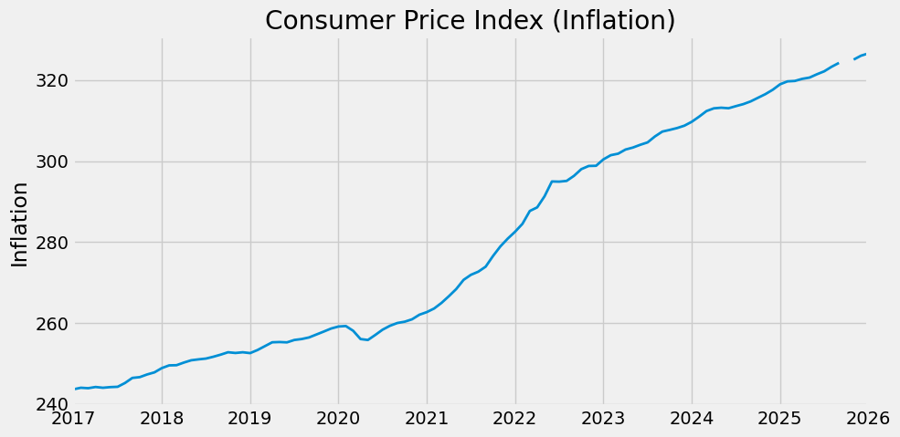
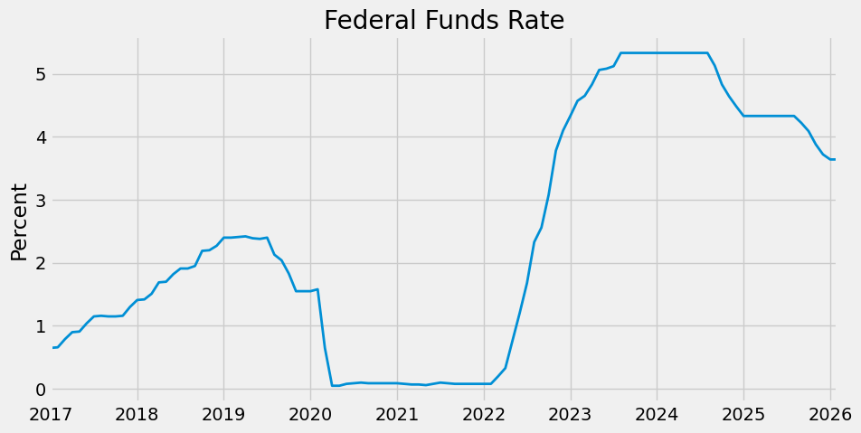
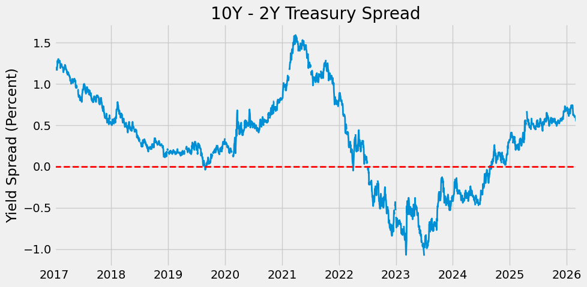
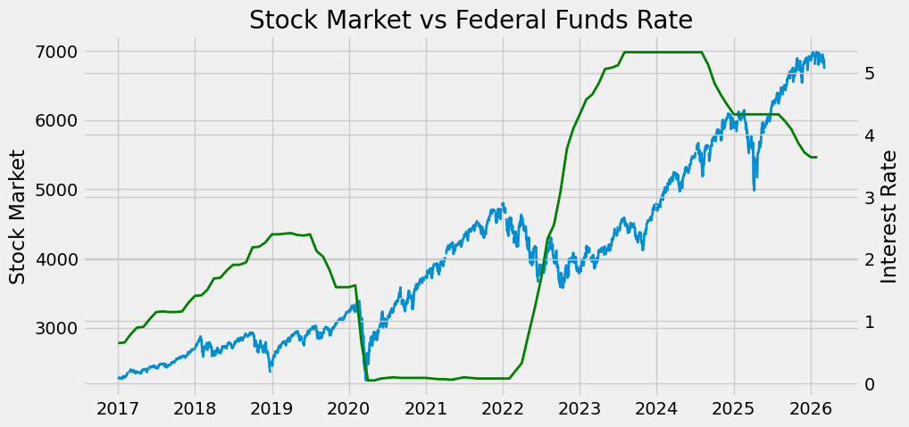
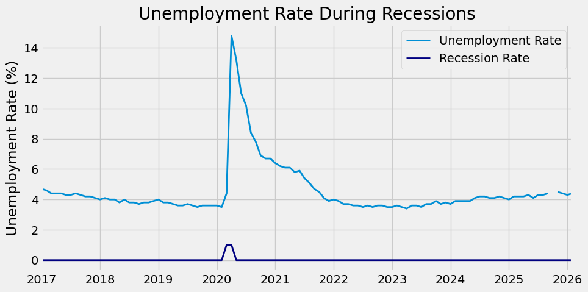
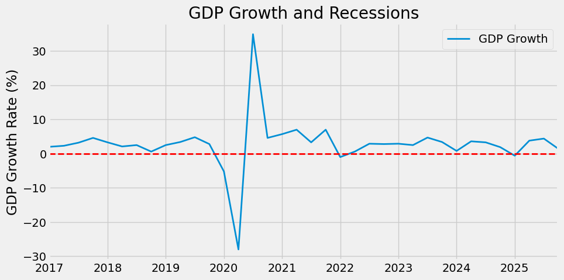

# FRED Economic Data Analysis Project

## Overview

This project is an end-to-end analysis of macroeconomic indicators using data from the Federal Reserve Economic Data (FRED) API. The goal is to explore how key economic variables interact over time and to extract meaningful insights about economic cycles, monetary policy, and market behavior.

The analysis is conducted in Python using a notebook-based workflow, with a strong focus on clarity, reproducibility, and real-world analytical thinking.

---

## Objectives

* Retrieve and analyze macroeconomic data directly from the FRED API
* Study relationships between key economic indicators
* Understand the impact of monetary policy on markets
* Identify patterns during recessionary periods
* Build a clean and reproducible data analysis workflow

---

## Project Structure

```text
FRED ECONOMIC PROJECT/
│
├── fred_env/               # Virtual environment (not tracked in Git)
├── fred_econ.ipynb         # Main analysis notebook
├── .env                    # Stores API key (not shared)
|
├── analysis_images/        # Stores all the EDA Visualization Images
|        └── cpi_index.png
|        └── federal_funds_rate.png
|        └── gdp_growth_cycle.png
|        └── gdp_growth_rate.png
|        └── nominal_vs_real_gdp.png
|        └── s&p500_during_recession.png
|        └── s&p500_index.png
|        └── stock_market_vs_federal_funds.png
|        └── unemployment_rate_recession.png
|        └── us_gdp.png
|        └── us_unemployment_rate.png
|        └── yield_curve_speed.png
|
├── .env.example            # Template for environment variables
├── .gitignore              # Files ignored by Git
├── requirements.txt        # Project dependencies
├── README.md               # Project documentation
├── LICENSE                 # License file
```

---

## Data Source

All data is sourced from the **FRED (Federal Reserve Economic Data)** API.

Key indicators analyzed include:

* Consumer Price Index (CPI)
* Federal Funds Rate
* 10Y–2Y Treasury Yield Spread
* S&P 500 Index
* Unemployment Rate
* GDP Growth

---

## Setup & Installation

### 1. Clone the repository

```bash
git clone https://github.com/WizardNox/FRED-Economic-Data-Analysis.git
cd fred-economic-project
```

---

### 2. Create and activate virtual environment

```bash
python -m venv fred_env
source fred_env/bin/activate   # Mac/Linux
fred_env\Scripts\activate      # Windows
```

---

### 3. Install dependencies

```bash
pip install -r requirements.txt
```

---

### 4. Set up environment variables

Create a `.env` file in the root directory:

```env
FRED_API_KEY=your_api_key_here
```

You can refer to `.env.example` as a template.

---

### 5. Run the notebook

```bash
jupyter notebook fred_econ.ipynb
```

---

## Analytical Approach

The analysis follows a structured workflow:

### 1. Data Collection

* Pulled time-series data directly from the FRED API
* Ensured consistent date ranges across indicators

### 2. Data Cleaning

* Handled missing values
* Aligned datasets for comparative analysis

### 3. Exploratory Analysis

* Visualized trends over time
* Compared indicators across economic cycles

### 4. Comparative Analysis

* Interest rates vs stock market performance
* Yield curve vs recession periods
* Inflation vs unemployment dynamics

---

## Key Analyses Performed

* **Inflation Trends (CPI)**
  Understanding long-term inflation behavior and spikes



* **Monetary Policy (Federal Funds Rate)**
  Studying how interest rates change over time



* **Yield Curve Analysis (10Y–2Y Spread)**
  Identifying inversion periods and their implications



* **Stock Market vs Interest Rates**
  Examining how equity markets react to rate changes



* **Unemployment During Recessions**
  Tracking labor market stress during downturns



* **GDP Growth & Economic Cycles**
  Understanding expansion and contraction phases



---

## Correlation Analysis

A correlation matrix was used to understand relationships between variables.

Key observations:

- GDP growth and unemployment move in opposite directions  
- Interest rates and stock market often move inversely  
- Inflation and interest rates are positively related  
- Yield curve behavior reflects expectations about future economic conditions  

---

## Key Insights

* The U.S. economy shows strong long-term growth despite short-term shocks  
* A major disruption occurs in 2020 with falling GDP and rising unemployment  
* The stock market crashes during this period but recovers quickly  
* Interest rates are cut to near zero during the crisis to support the economy  
* Inflation rises sharply after 2021, leading to aggressive rate hikes  
* The yield curve inverts during this period, signaling possible slowdown  
* Over time, the economy stabilizes and continues growing 

---

## Tools & Technologies

* Python
* Jupyter Notebook
* Pandas
* Numpy
* Matplotlib
* Plotly
* FRED API

---

## Environment & Reproducibility

* Sensitive information (API keys) is stored in `.env` and excluded via `.gitignore`
* `.env.example` is provided for easy setup
* `requirements.txt` ensures consistent dependency management

---

## Notes

* This project focuses on building a structured approach to economic data analysis — not just plotting indicators, but understanding how they interact and what they imply about the broader economy.

* The emphasis is on clarity, reproducibility, and developing an analytical mindset that can be applied to real-world financial and economic problems.

---

## Key Learning

This project helped me understand how macroeconomic indicators interact and how economic shocks affect different parts of the economy. It also improved my skills in data analysis, visualization, and working with real-world datasets using Python.

---

## License

This project is licensed under the terms of the LICENSE file.